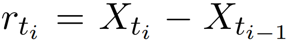

# HAR models forecasting realized volatility in US stocks
Various heterogenous autoregressive (HAR) models in Bollerslev et al. (2016) implemented in R to forecast the intraday measure of realized volatilty in select US stocks based on high-frequency trading prices.

### Data
Intraday prices of US stocks of Microsoft, McDonalds, J.P. Morgan & Chase, Disney and a S&P500 trust fund (SPY) were extracted at frequencies of 1, 5 and 10 minutes with the Bloomberg Terminal. The time-series span from March 1st 2019 to November 1st 2019,

### Returns and realized volatility
Intraday returns are computed as the change in intraday prices of a given financial asset,
, the sum of all these intraday returns constitute the realized volatilty (variance if squared) estimate of a given day: 


Related measures like realized quarticity (RQ) and bi-power variance (BPV) that are used by some model variants were also estimated in R

```r
#RV, RQ, BPV Estimator
estimator <- function(data) {
  RV_t_estimates = c()
  RQ_t_estimates = c()
  BPV_t_estimates = c()
  RV_t_plus_estimates = c()
  RV_t_minus_estimates = c()
  RV_t_dates = c()
  M = 0 # Intraday obs used in estimation of RV_t
  
  for (t in 1:length(data$Dates)) {
    # t accounts for the final number of daily RV_t estimates
    RV_t_i_estimates = c() # M number of r_t,i to be summed up
    M_Q = M # Counter
    
    while (substring(data$Dates[t+M], first = 1, last = 5) == substring(data$Dates[t+M+1], first = 1, last = 5)
           # The below AND condition breaks while-loop when no more intraday obs available
           & !is.na(data$Dates[t+M+1])) {
      
      # Intraday returns 
      RV_t_i = (data$Open[t+M+1] - data$Open[t+M])
      RV_t_i_estimates = c(RV_t_i_estimates, RV_t_i)
      
      M = M + 1
    }
    
    if (is.na(data$Dates[t+M])) {
      break # This if-clause breaks for-loop when the eventual NA intraday obs is reached 
    }
    
    RV_t = sum(RV_t_i_estimates^2) #Realized Variance
    
    RQ_t = ((M-M_Q)/3) * sum(RV_t_i_estimates^4)

    BPV_t_i_estimates = c()
    # i in 1:len(...)-1 corresponds to summing up to M-1 as in Bollerslev (2016)
    for (i in 1:(length(RV_t_i_estimates)-1)) {
      BPV_t_i_estimates = c(BPV_t_i_estimates, abs(RV_t_i_estimates[i] * abs(RV_t_i_estimates[i+1])))
    }
    BPV_t = (sqrt(2/pi))^(-2) * sum(BPV_t_i_estimates)
    
    # RV Plus and RV Minus for SHAR model spec
    RV_t_plus = sum(RV_t_i_estimates[RV_t_i_estimates > 0]^2)
    RV_t_minus = sum(RV_t_i_estimates[RV_t_i_estimates < 0]^2)
    
    RV_t_estimates = c(RV_t_estimates, RV_t)
    RQ_t_estimates = c(RQ_t_estimates, RQ_t)
    BPV_t_estimates = c(BPV_t_estimates, BPV_t)
    RV_t_plus_estimates = c(RV_t_plus_estimates, RV_t_plus)
    RV_t_minus_estimates = c(RV_t_minus_estimates, RV_t_minus)
    
    # Dates
    RV_t_date = as.numeric(substring(data$Dates[t+M], first = 1, last = 5))
    RV_t_dates = c(RV_t_dates, RV_t_date)
  }
  
  RV_df = as.data.frame(RV_t_dates)
  RV_df = cbind(RV_df, RV_t_estimates, RQ_t_estimates, BPV_t_estimates, RV_t_plus_estimates, RV_t_minus_estimates)
  colnames(RV_df) = c("Dates", "RV", "RQ", "BPV", "RV_plus", "RV_minus")
  RV_df$Dates = as.Date(RV_df$Dates, origin = "1899-12-30")
  return(RV_df)
}
```


### HAR models
The objective is to fit different HAR model variants to an in-sample portion of the time-series, to then predict an out-of-sample test sample. The fundamental HAR model is given: 


This project includes implementation and tests of model variants that account for error minimizing returns quarticity, leverage effects and jumps in the data.

The R implementation could have been optimized by vectorizing the computations, it nevertheless runs in a small amount of time:

```r
#Forecast, Errors, Betas & Plots
HAR <- function(data, out_sample = 96, plot_scalar = 1, extra_plots = FALSE) {
  
  RV = data$RV
  RQ = data$RQ
  BPV = data$BPV
  RV_p = data$RV_plus
  RV_m = data$RV_minus
  
  nobs = length(RV)
  in_sample = nobs - out_sample
  
  outRV = RV[(in_sample+1):(length(RV))] # We +1 to get equal length as out_sample size
  lag = 22 # 22 days lag is equivalent to one month of trading days lag
  
  all_predsA = rep(0, times = out_sample)
  all_preds = rep(0, times = out_sample)
  all_predsQ = rep(0, times = out_sample)
  all_predsF = rep(0, times = out_sample)
  all_predsC = rep(0, times = out_sample)
  all_predsS = rep(0, times = out_sample)
  all_predsJ = rep(0, times = out_sample)
  
  all_betasA = matrix(rep(0, times = out_sample), nrow = out_sample, ncol = 4)
  all_betas = matrix(rep(0, times = out_sample), nrow = out_sample, ncol = 4)
  all_betasQ = matrix(rep(0, times = out_sample), nrow = out_sample, ncol = 5)
  all_betasF = matrix(rep(0, times = out_sample), nrow = out_sample, ncol = 7)
  all_betasC = matrix(rep(0, times = out_sample), nrow = out_sample, ncol = 4)
  all_betasS = matrix(rep(0, times = out_sample), nrow = out_sample, ncol = 5)
  all_betasJ = matrix(rep(0, times = out_sample), nrow = out_sample, ncol = 5)
  
  for (t in 1:(out_sample)) {
    # Estimation
    y = RV[(lag + t + 1):(in_sample + t)]
    XA = matrix(rep(0, times = in_sample-lag), nrow = in_sample-lag, ncol = 3)
    X = matrix(rep(0, times = in_sample-lag), nrow = in_sample-lag, ncol = 3)
    XQ = matrix(rep(0, times = in_sample-lag), nrow = in_sample-lag, ncol = 4)
    XF = matrix(rep(0, times = in_sample-lag), nrow = in_sample-lag, ncol = 6)
    XC = matrix(rep(0, times = in_sample-lag), nrow = in_sample-lag, ncol = 3)
    XS = matrix(rep(0, times = in_sample-lag), nrow = in_sample-lag, ncol = 4)
    XJ = matrix(rep(0, times = in_sample-lag), nrow = in_sample-lag, ncol = 4)
    
    for (i in 0:(in_sample - lag - 1)) {
      
      # AR(3)
      XA[i+1,1] = RV[(-1+i+1+lag + t)]
      XA[i+1,2] = RV[(-2+i+1+lag + t)]
      XA[i+1,3] = RV[(-3+i+1+lag + t)]
      
      # HAR
      X[i+1,1] = RV[(-1+i+1+lag + t)]
      X[i+1,2] = (1/5)*sum(RV[(-5+i+1+lag + t):(i+lag + t)])
      X[i+1,3] = (1/22)*sum(RV[(-22+i+1+lag + t):(i+lag + t)])
      
      # HARQ
      XQ[i+1,1] = RV[(-1+i+1+lag + t)]
      XQ[i+1,2] = (1/5)*sum(RV[(-5+i+1+lag + t):(i+lag + t)])
      XQ[i+1,3] = (1/22)*sum(RV[(-22+i+1+lag + t):(i+lag + t)])
      XQ[i+1,4] = (RQ[-1+i+1+lag + t]^(1/2) * RV[(-1+i+1+lag + t)])
      
      # HARQ-F
      XF[i+1,1] = RV[(-1+i+1+lag + t)]
      XF[i+1,2] = (1/5)*sum(RV[(-5+i+1+lag + t):(i+lag + t)])
      XF[i+1,3] = (1/22)*sum(RV[(-22+i+1+lag + t):(i+lag + t)])
      XF[i+1,4] = (RQ[-1+i+1+lag + t]^(1/2) * RV[(-1+i+1+lag + t)])
      XF[i+1,5] = (((1/5)*sum(RQ[(-5+i+1+lag + t):(i+lag + t)]))^(1/2) * ((1/5)*sum(RV[(-5+i+1+lag + t):(i+lag + t)])))
      XF[i+1,6] = (((1/22)*sum(RQ[(-22+i+1+lag + t):(i+lag + t)]))^(1/2) * ((1/22)*sum(RV[(-22+i+1+lag + t):(i+lag + t)])))
      
      # CHAR
      XC[i+1,1] = BPV[(-1+i+1+lag + t)]
      XC[i+1,2] = (1/5)*sum(BPV[(-5+i+1+lag + t):(i+lag + t)])
      XC[i+1,3] = (1/22)*sum(BPV[(-22+i+1+lag + t):(i+lag + t)])
      
      # SHAR
      XS[i+1,1] = (1/5)*sum(RV[(-5+i+1+lag + t):(i+lag + t)])
      XS[i+1,2] = (1/22)*sum(RV[(-22+i+1+lag + t):(i+lag + t)])
      XS[i+1,3] = RV_p[(-1+i+1+lag + t)]
      XS[i+1,4] = RV_m[(-1+i+1+lag + t)]
      
      # HAR-J
      XJ[i+1,1] = RV[(-1+i+1+lag + t)]
      XJ[i+1,2] = (1/5)*sum(RV[(-5+i+1+lag + t):(i+lag + t)])
      XJ[i+1,3] = (1/22)*sum(RV[(-22+i+1+lag + t):(i+lag + t)])
      XJ[i+1,4] = max((RV[(-1+i+1+lag + t)] - BPV[(-1+i+1+lag + t)]), 0)
      
    }
    
    
    # R Regression at t=1 for Standard Errors before performing any out-of-sample forecasts
    if (t==out_sample) {
      modelA = lm(y ~ XA)
      model = lm(y ~ X)
      modelQ = lm(y ~ XQ)
      modelF = lm(y ~ XF)
      modelC = lm(y ~ XC)
      modelS = lm(y ~ XS)
      # HAR-J if statement:
      if (sum(XJ[,4]) ==0) {
        XJ[1,4] = 0.1 # Ensure invertibility if XJ singular with zero column
      }
      modelJ = lm(y ~ XJ)
      models_at_t_1 = list("modelA" = modelA, "model" = model, 
                           "modelQ" = modelQ, "modelF" = modelF, 
                           "modelC" = modelC, "modelS" = modelS, 
                           "modelJ" = modelJ)
      
      # Below we retrieve R^2 & Adjusted R^2, prior to out-of-sample forecasts
      num_of_models = 7
      r_squareds = matrix(0, nrow = 2, ncol = num_of_models)
      for (val in 1:length(models_at_t_1)) {
        r_squareds[1,val] = summary(models_at_t_1[[val]])$r.squared
        r_squareds[2,val] = summary(models_at_t_1[[val]])$adj.r.squared
      }
      rownames(r_squareds) = c("R-squared", "Adj.R-squared")
      colnames(r_squareds) = c("AR(3)", "HAR", "HARQ", "HARQ-F", "CHAR", "SHAR", "HAR-J")
      
    }
    
    XA = cbind(rep(1, times = nrow(XA)), XA)
    X = cbind(rep(1, times = nrow(X)), X)
    XQ = cbind(rep(1, times = nrow(XQ)), XQ)
    XF = cbind(rep(1, times = nrow(XF)), XF)
    XC = cbind(rep(1, times = nrow(XC)), XC)
    XS = cbind(rep(1, times = nrow(XS)), XS)
    XJ = cbind(rep(1, times = nrow(XJ)), XJ)
    
    # HAR-J if statement:
    if (sum(XJ[,5]) ==0) {
      XJ[1,5] = 0.1 # Ensure invertibility if XJ singular with zero column
    }
    
    # OLS Regression
    betasA = solve(t(XA) %*% XA) %*% t(XA) %*% y
    betas = solve(t(X) %*% X) %*% t(X) %*% y
    betasQ = solve(t(XQ) %*% XQ) %*% t(XQ) %*% y
    betasF = solve(t(XF) %*% XF) %*% t(XF) %*% y
    betasC = solve(t(XC) %*% XC) %*% t(XC) %*% y
    betasS = solve(t(XS) %*% XS) %*% t(XS) %*% y
    betasJ = solve(t(XJ) %*% XJ) %*% t(XJ) %*% y
    
    b0A = betasA[1]
    b1A = betasA[2]
    b2A = betasA[3]
    b3A = betasA[4]
    
    b0 = betas[1]
    b1 = betas[2]
    b2 = betas[3]
    b3 = betas[4]
    
    b0Q = betasQ[1]
    b1Q = betasQ[2]
    b2Q = betasQ[3]
    b3Q = betasQ[4]
    b1Q_Q = betasQ[5]
    
    b0F = betasF[1]
    b1F = betasF[2]
    b2F = betasF[3]
    b3F = betasF[4]
    b1F_Q = betasF[5]
    b2F_Q = betasF[6]
    b3F_Q = betasF[7]
    
    b0C = betasC[1]
    b1C = betasC[2]
    b2C = betasC[3]
    b3C = betasC[4]
    
    b0S = betasS[1]
    b1S_P = betasS[2]
    b2S = betasS[3]
    b3S = betasS[4]
    b1S_M = betasS[5]
    
    b0J = betasJ[1]
    b1J = betasJ[2]
    b2J = betasJ[3]
    b3J = betasJ[4]
    bJ = betasJ[5]
    
    all_betasA[t,1] = b0A
    all_betasA[t,2] = b1A
    all_betasA[t,3] = b2A
    all_betasA[t,4] = b3A
    
    all_betas[t,1] = b0
    all_betas[t,2] = b1
    all_betas[t,3] = b2
    all_betas[t,4] = b3
    
    all_betasQ[t,1] = b0Q
    all_betasQ[t,2] = b1Q
    all_betasQ[t,3] = b2Q
    all_betasQ[t,4] = b3Q
    all_betasQ[t,5] = b1Q_Q
    
    all_betasF[t,1] = b0F
    all_betasF[t,2] = b1F
    all_betasF[t,3] = b2F
    all_betasF[t,4] = b3F
    all_betasF[t,5] = b1F_Q
    all_betasF[t,6] = b2F_Q
    all_betasF[t,7] = b3F_Q
    
    all_betasC[t,1] = b0C
    all_betasC[t,2] = b1C
    all_betasC[t,3] = b2C
    all_betasC[t,4] = b3C
    
    all_betasS[t,1] = b0S
    all_betasS[t,2] = b1S_P
    all_betasS[t,3] = b2S
    all_betasS[t,4] = b3S
    all_betasS[t,5] = b1S_M
    
    all_betasJ[t,1] = b0J
    all_betasJ[t,2] = b1J
    all_betasJ[t,3] = b2J
    all_betasJ[t,4] = b3J
    all_betasJ[t,5] = bJ
    
    
    
    # Prediction at time-step t
    predA = b0A + b1A*XA[nrow(XA),2] + b2A*XA[nrow(XA),3] + b3A*XA[nrow(XA),4]
    pred = b0 + b1*X[nrow(X),2] + b2*X[nrow(X),3] + b3*X[nrow(X),4]
    predQ = b0Q + b1Q*XQ[nrow(XQ),2] + b2Q*XQ[nrow(XQ),3] + b3Q*XQ[nrow(XQ),4] + b1Q_Q*XQ[nrow(XQ),5]
    predF = b0F + b1F*XF[nrow(XF),2] + b2F*XF[nrow(XF),3] + b3F*XF[nrow(XF),4] + b1F_Q*XF[nrow(XF),5] + b2F_Q*XF[nrow(XF),6] + b3F_Q*XF[nrow(XF),7]
    predC = b0C + b1C*XC[nrow(XC),2] + b2C*XC[nrow(XC),3] + b3C*XC[nrow(XC),4]
    predS = b0S + b1S_P*XS[nrow(XS),2] + b2S*XS[nrow(XS),3] + b3S*XS[nrow(XS),4] + b1S_M*XS[nrow(XS),5]
    predJ = b0J + b1J*XJ[nrow(XJ),2] + b2J*XJ[nrow(XJ),3] + b3J*XJ[nrow(XJ),4] + bJ*XJ[nrow(XJ),5]
    
    # Saving time-step t prediction within list for error computations
    all_predsA[t] = predA
    all_preds[t] = pred
    all_predsQ[t] = predQ
    all_predsF[t] = predF
    all_predsC[t] = predC
    all_predsS[t] = predS
    all_predsJ[t] = predJ
    
  }
  
  # Error Computations: Mean Squared Error & Mean Absolute Error
  AR_mse = mean((outRV - all_predsA)^2)
  AR_mae = mean(abs(outRV - all_predsA))
  
  HAR_mse = mean((outRV - all_preds)^2)
  HAR_mae = mean(abs(outRV - all_preds))
  
  HARQ_mse = mean((outRV - all_predsQ)^2)
  HARQ_mae = mean(abs(outRV - all_predsQ))
  
  HARQF_mse = mean((outRV - all_predsF)^2)
  HARQF_mae = mean(abs(outRV - all_predsF))
  
  CHAR_mse = mean((outRV - all_predsC)^2)
  CHAR_mae = mean(abs(outRV - all_predsC))
  
  SHAR_mse = mean((outRV - all_predsS)^2)
  SHAR_mae = mean(abs(outRV - all_predsS))
  
  HARJ_mse = mean((outRV - all_predsJ)^2)
  HARJ_mae = mean(abs(outRV - all_predsJ))
  
  
  errors_list = list("AR_mse" = AR_mse, "AR_mae" = AR_mae, "HAR_mse" = HAR_mse, "HAR_mae" = HAR_mae,
                "HARQ_mse" = HARQ_mse, "HARQ_mae" = HARQ_mae, "HARQF_mse" = HARQF_mse, "HARQF_mae" = HARQF_mae,
                "CHAR_mse" = CHAR_mse, "CHAR_mae" = CHAR_mae, "SHAR_mse" = SHAR_mse, "SHAR_mae" = SHAR_mae,
                "HARJ_mse" = HARJ_mse, "HARJ_mae" = HARJ_mae)
  
  
  # Output formatting: 
  output = matrix(outRV)
  out_sample_dates = data$Date[(in_sample+1):length(data$Date)] 
  output = cbind(out_sample_dates, output, all_predsA, all_preds, all_predsQ, all_predsF, all_predsC, all_predsS, all_predsJ)
  output_df = as.data.frame(output)
  colnames(output_df) = c("Date", "outRV", "all_predsA", "all_preds", "all_predsQ", "all_predsF", "all_predsC", "all_predsS", "all_predsJ")
  betas_list = list("all_betasA" = all_betasA, "all_betas" = all_betas, "all_betasQ" = all_betasQ, 
                    "all_betasF" = all_betasF, "all_betasC" = all_betasC, "all_betasS" = all_betasS, 
                    "all_betasJ" = all_betasJ)
  
  output_df_errors_betas = list(output_df, errors_list, betas_list, models_at_t_1, r_squareds)
  
  return(output_df_errors_betas)
}
```


### Beta coefficients estimated in-sample


### Out-of-sample forecasting


### Project conclusion

HAR-type models fits nicely to measures representing intraday price movements. The out-of-sample forecast results suggest that the HARQ-F model outperforms all other variants along with a simple AR(3) model. 

The HARQ-F includes a realized quarticity measure to minimze error, which may contribute to the superior forecasting ability of this model variant. 

Time-series extended further back in time would be desirable for both in-sample coefficient estimations and out-of-sample forecasting, however the limitation of readily available intra-day price data prohibited a longer time horizon in this project. 
